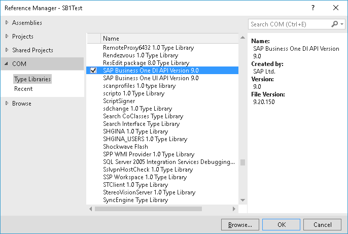
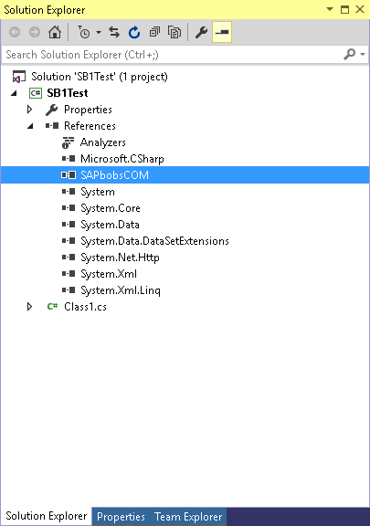
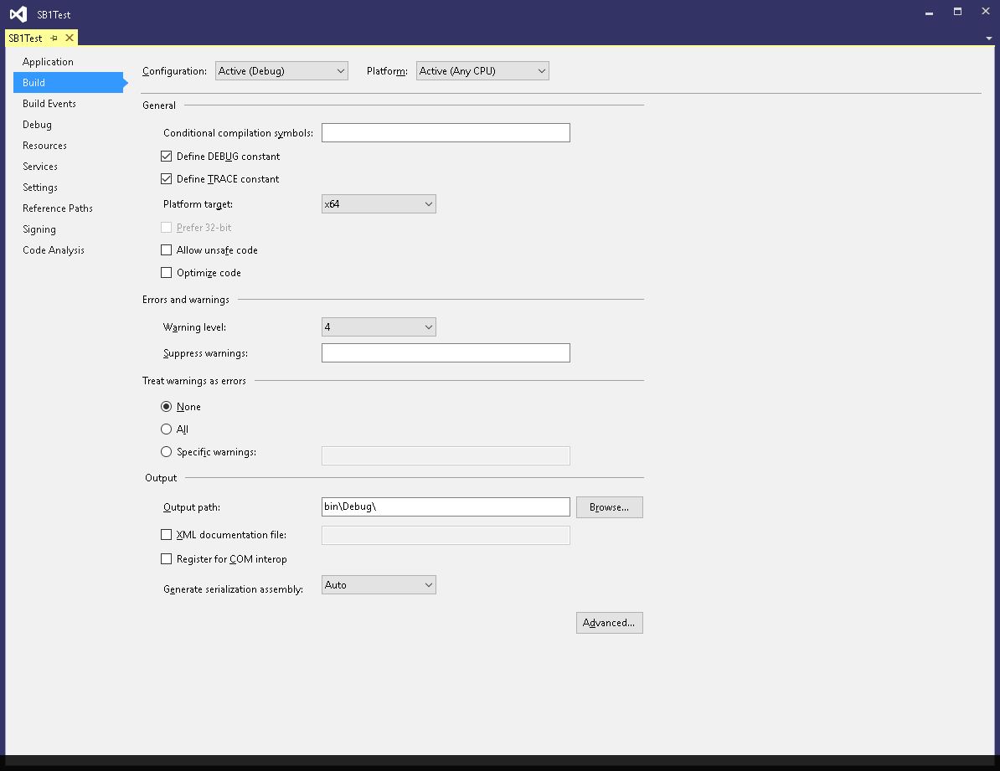

# SAP Development

## SAP business one (SB1) SDK integration

# Introduction

This article includes a basic knowledge about **S**AP **D**evelopment **K**it (SDK).

[SAP](https://en.wikipedia.org/wiki/SAP_Business_One) software is an [ERP](https://en.wikipedia.org/wiki/Enterprise_resource_planning) that provides several modules which handle different business processes.

The SDK allows software customizations and integration in a safe, complete and organized environment, as opposed to writing direct SQL statements to SQL Server&#39;s SAP database.

The SAP business one ERP software works with many databases - the key ones are DB2, MS SQL, Oracle, and HANA.

It is possible to read data directly from the database, but it is **forbidden** to add new data or change data (write operation) directly to the database because of the following reasons:

- SAP warranty – SAP won&#39;t supports damages caused by a direct change of SAP data.
- Data integrity – depended on data won&#39;t be updated.
- Performance – update deadlocks and other performance problem caused by writing data without queue or buffer.


# Principles

In order to use the SB1 SDK properly it is important to understand some basic principles:

Data integrity – update via SB1 SDK force the same validation as the SAP client application, so you cannot change prices on a closed status document or add document without fill-in all mandatory fields, and more other validation rules that happen on application screen like values range and type.

Document identity is not DocNum but DocEntry!

The SDK includes two main part Di API – for data manipulations, and Ui API – for user interface modifications.

This article focused on the Di API.


# Installation

The SDK can be found on the SB1 client installation pack, under **Packages\SDK**.

After installation, the Di DLL can be added to the .NET project.





In some cases, the project must be configured as 64bit in order to be compiled successfully.




#  Objects update model

A code example for company&#39;s database connection.

**C#**

```csharp
int res = 0;
string strret = "";
SAPbobsCOM.Company oCompany = new SAPbobsCOM.Company();
oCompany.DbServerType = SAPbobsCOM.BoDataServerTypes.dst_MSSQL2008;
oCompany.Server = "127.0.0.1"; //ip or server name for the SQL Server 
oCompany.UseTrusted = false; 
oCompany.CompanyDB = "db_name";
oCompany.UserName = "SomeUser";
oCompany.Password = "******"; 
oCompany.Connect();
oCompany.GetLastError(out res, out strret);
strret = oCompany.GetLastErrorDescription();
MessageBox.Show(strret);  
```


After connecting the company&#39;s DB other actions can be done, for example, add a new order document.

**C#**

```csharp
SAPbobsCOM.Documents oDoc = oCompany.GetBusinessObject(SAPbobsCOM.BoObjectTypes.oOrders);
SAPbobsCOM.Document_Lines oLines = oDoc.Lines;
oDoc.CardCode = "12341234";
oDoc.DocDate = DateTime.Now;oDoc.DocDueDate = DateTime.Now.AddDays(10);
oLines.ItemCode = "ABC12345";
oLines.Price = 100;
oLines.Add();
oLines.ItemCode = "ABCD4321";
oLines.Price = 120;
int res = oDoc.Add();
if (res != 0)
{
  MessageBox.Show(oCompany.GetLastErrorDescription());
}
else
{   
  MessageBox.Show(oCompany.GetNewObjectKey()); //@scope_identity
}  
```

For updating an existing order document,  DocEntry must be fetched first by SQL query or another method.

**C#**

```csharp
SAPbobsCOM.Documents oDocToUpdate = oCompany.GetBusinessObject(SAPbobsCOM.BoObjectTypes.oOrders);
SAPbobsCOM.Document_Lines oLinesToUpdate = oDocToUpdate.Lines;
int DocEntry = 217022334;
if(oDocToUpdate.GetByKey(DocEntry))
{    
  oLinesToUpdate.SetCurrentLine(1);
  oLinesToUpdate.Price = 50;
  oLinesToUpdate.Add();
  oLinesToUpdate.SetCurrentLine(2);
  oLinesToUpdate.ItemCode = "ABCD4321";    
  oLinesToUpdate.Price = 100;     
  res = oDocToUpdate.Update();
} 
```


# XML update model
There is another way, for adding or updating SAP Documents - by sending XML structures.
This technique is quicker - run faster, and more important, it open new XML manipulation options for a more generic mechanism.
Using this method for insert new documents is very easy, thou update an existing document is much more complex.

Receiving the schema
**C#**
```csharp
oCompany.XmlExportType = SAPbobsCOM.BoXmlExportTypes.xet_ExportImportMode;
oCompany.XMLAsString = false;
string xmlSchema = oCompany.GetBusinessObjectXmlSchema(SAPbobsCOM.BoObjectTypes.oBusinessPartners);
System.IO.File.WriteAllText(@"C:\TEMP\bp.xml", xmlSchema); 
```

Converting Object to XML 
**C#**
```csharp
SAPbobsCOM.BusinessPartners oBP = oCompany.GetBusinessObject(SAPbobsCOM.BoObjectTypes.oBusinessPartners);
oBP.GetByKey("12186938");
System.IO.File.WriteAllText("C:\\TEMP\\bp.xml", oBP.GetAsXML());
```

Loading XML to an Object and adding the new Object
**C#**
```csharp
int count = oCompany.GetXMLelementCount("C:\\TEMP\\bp.xml");
for(int i=0; i < count; i++)
{     
  SAPbobsCOM.BoObjectTypes type = oCompany.GetXMLobjectType("C:\\TEMP\\bp.xml", i);
  oBP = oCompany.GetBusinessObjectFromXML("C:\\TEMP\\bp.xml", i);
  res = oBP.Add();
} 
```


